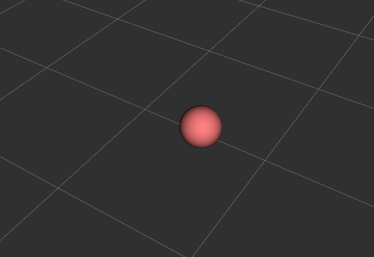

# RViz Marker Tools

 [](https://www.gnu.org/licenses/gpl-3.0)


**Robotics and Autonomous Systems Group, Research Engineering Facility, Research Infrastructure** 
**Queensland University of Technology**

## Introduction

The RViz mark tools is a ROS 1 (noetic) based Python module for simplifying the rendering of markers in RViz. Markers are primitive shapes or custom mesh objects displayed at specified poses. Here are common use cases of RViz markers.
- Scene object visualization.
- Highlighting regions, planes, orientations, and positions for planning and reference.
- Object animation or simulation.

The method of rendering of markers in ROS 1 is by publishing a `visualization_msgs.msg.Marker` message to a topic subscribed by RViz. The population of an `Marker` object is tedious and there are subtle differences for different marker types. The RViz Marker Tools offers an easy-to-use programming interface for the management of marker rendering. For example, displaying a sphere at the position (1, 1, 1) is just one line of code after creating the core class of `RVizVisualizer`. The function `create_sphere_marker` is a helper function for creating a `Marker` object for a sphere, and the function `rv.add_persistent_marker` receives the object for `RVizVisualizer` as a persistent marker. The `RVizVisualizer` object is designed to publish the stored persistent marker objects regularly and to provide other marker related features.

```python
rv = RvizVisualizer()
rv.add_persistent_marker(create_sphere_marker(name='sphere', id=1, xyz=[1, 1, 1], reference_frame='map', dimensions=0.20, rgba=[1.0, 0.5, 0.5, 1.0])) 
```
The full program `basic_marker_1.py` can be found under the folder `examples`. 


Major features of the `RVizVisualizer`:
- Manages markers and publish them at a customizable rate autonomously.
- Supports publish-once markers (i.e. temporary markers) and publish-regularly markers (i.e. persistent markers).
- Publishes transforms of a marker optionally.
- Allows the removal of persistent markers.
- Supports rendering of images as pointclouds.

`Marker` object creation functions supported in the rviz marker tools:
- A plane object indicating an axis plane (xy, yz, or xz) given a 2D bounding box.
- A 3D box object given a 3D bounding box.
- A 3D box object given the position, orientation and dimension.
- An arrow marker.
- A line marker.
- A path marker made up of multiple waypoints.
- A sphere marker.
- A cylinder marker.
- A text marker.
- An object marker specified by a mesh file.

## Installation Guide

The rviz marker tools are defined mainly in the file `rviz_tools.py` under the module folder `rviz_marker`. It also depends on the supporting Python program files under the same folders.

There are two installation methods: as a part of source code or as a ROS package

### Install as Python source code

Copy the folder `rviz_marker` to make it part of the project source code. Adjust the module import code according to where it is placed.

### Install as a ROS Worksapce Package

Set it up as a package in a ROS workspace. This repository is already structured as a package named `rviz_marker_tools`. Clone this repository under the `src` folder of a workspace.
```
cd ~/catkin_ws/src
git clone git@github.com:REF-RAS/rviz_marker_tools.git
```
### Setup RViz

On a RViz with default configurations, add to the Displays the visualizations of **Marker**, **PointCloud2**, and **TF**. Press the _Add_ button at the bottom of the _Displays_ panel and select the above visualizations from the list in the popup window. 

Markers and pointclouds are sent via ROS messages under two topics. The default topic names are `/visualization_marker` and `/visualization_cloud`. Make sure the topic names are also specified as aforementioned in the display configuration tree in RViz. The default RViz configurations required are specified in the `example.rviz` file under `rviz`. To launch RViz using the configuration file, execute the following.

```bash
roslaunch rviz_marker_tools example.launch
```


The topics can be specified programmatically through the constructor of `RVizVisualizer`. Refer to `examples/topic_config.py` as listed below.
```python
rv = RvizVisualizer(topic_marker='rviz_marker', topic_cloud='rviz_cloud')
```
## Programming Guide


## API Reference


### Developer

Dr Andrew Lui, Senior Research Engineer <br />
Robotics and Autonomous Systems, Research Engineering Facility <br />
Research Infrastructure <br />
Queensland University of Technology <br />

Latest update: May 2024
