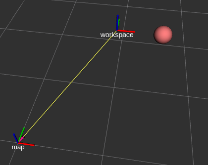

# RViz Marker Tools

 [](https://www.gnu.org/licenses/gpl-3.0)


**Robotics and Autonomous Systems Group, Research Engineering Facility, Research Infrastructure** 
**Queensland University of Technology**

## Introduction

The RViz mark tools is a ROS 1 (noetic) based Python module for simplifying the rendering of markers in RViz. Markers are primitive shapes or custom mesh objects displayed at specified poses. Here are common use cases of RViz markers.
- Scene object visualization.
- Highlighting regions, planes, orientations, and positions for planning and reference.
- Object animation or simulation.

The method of rendering of markers in ROS 1 is by publishing a `visualization_msgs.msg.Marker` message to a topic subscribed by RViz. The population of an `Marker` object is tedious and there are subtle differences for different marker types. The RViz Marker Tools offers an easy-to-use programming interface for the management of marker rendering. For example, displaying a sphere at the position (1, 1, 1) is just one line of code after creating the core class of `RVizVisualizer`. The function `create_sphere_marker` is a helper function for creating a `Marker` object for a sphere, and the function `rv.add_persistent_marker` receives the object for `RVizVisualizer` as a persistent marker. The `RVizVisualizer` object is designed to publish the stored persistent marker objects regularly and to provide other marker related features.

`MarkerArray`, which is a message that can hold an array of `Marker`, offers more efficient rendering. The function `rv.add_persistent_marker_array` accepts a `MarkerArray` object and publish it persistently.

```python
rv = RvizVisualizer()
rv.add_persistent_marker(create_sphere_marker(name='sphere', id=1, xyz=[1, 1, 1], reference_frame='map', dimensions=0.20, rgba=[1.0, 0.5, 0.5, 1.0])) 
```
The full program `basic_marker_1.py` can be found under the folder `examples`. 


Major features of the `RVizVisualizer`:
- Manages markers and publish them at a customizable rate autonomously.
- Supports publish-once markers (i.e. temporary markers) and publish-regularly markers (i.e. persistent markers).
- Publishes transforms of a marker optionally.
- Allows the removal of persistent markers.
- Supports rendering of images as pointclouds.

`Marker` object creation functions supported in the rviz marker tools:
- A plane object indicating an axis plane (xy, yz, or xz) given a 2D bounding box.
- A 3D box object given a 3D bounding box.
- A 3D box object given the position, orientation and dimension.
- An arrow marker.
- A line marker.
- A path marker made up of multiple waypoints.
- A sphere marker.
- A cylinder marker.
- A text marker.
- An object marker specified by a mesh file.

## Installation Guide

The rviz marker tools are defined mainly in the file `rviz_tools.py` under the module folder `rviz_marker`. It also depends on the supporting Python program files under the same folders.

There are two installation methods: as a part of source code or as a ROS package

### Install as Python source code

Copy the folder `rviz_marker` to make it part of the project source code. Adjust the module import code according to where it is placed.

### Install as a ROS Worksapce Package

Set it up as a package in a ROS workspace. This repository is already structured as a package named `rviz_marker_tools`. Clone this repository under the `src` folder of a workspace.
```bash
cd ~/catkin_ws/src
git clone git@github.com:REF-RAS/rviz_marker_tools.git
```
### Python Dependency

The rviz marker tools has been tested on Python 3.8 or above and ROS 1 noetic, and requires several Python modules. 
```bash
pip install opencv_contrib_python rospkg
```

### Setup RViz

On a RViz with default configurations, add to the Displays the visualizations of **Marker**, **PointCloud2**, and **TF**. Press the _Add_ button at the bottom of the _Displays_ panel and select the above visualizations from the list in the popup window. 

Markers and pointclouds are sent via ROS messages under two topics. The default topic names are `/visualization_marker` and `/visualization_cloud`. Make sure the topic names are also specified as aforementioned in the display configuration tree in RViz. The default RViz configurations required are specified in the `example.rviz` file under `rviz`. To launch RViz using the configuration file, execute the following.

```bash
roslaunch rviz_marker_tools example.launch
```


The topics can be specified programmatically through the constructor of `RVizVisualizer`. Refer to `examples/topic_config.py` as listed below.
```python
rv = RvizVisualizer(topic_marker='rviz_marker', topic_cloud='rviz_cloud')
```
## Programming Guide

The following examples assume that the rviz marker tools is installed as the `rviz_marker` module.

### Adding a Persistent Marker
```python
rospy.init_node('test_rv_node', anonymous=False)   

# create the RVizVisualizer 
rv = RvizVisualizer()
# add a sphere marker as a persistent marker to the RVizVisualizer
sphere_marker = create_sphere_marker(name='sphere', id=1, xyz=[1, 1, 1], reference_frame='map', dimensions=0.20, rgba=[1.0, 0.5, 0.5, 1.0])
rv.add_persistent_marker(sphere_marker) 

rospy.spin()
```
Before creating a `RvizVisualizer` object, the ros node must be initialized. The function `create_sphere_marker` returns a sphere marker object of the given attributes. The marker object is added to the `RvizVisualizer` object as a persistent marker.

A persistent marker gets published regularly so that its updated attributes can be reflected in the visualization.

#### The Namespace and the ID of Markers

The name and the id of a marker form a composite key that should be unique to a RViz scene. The name refers to the namespace, which can be controlled as a logical unit in RViz. One approach to naming the markers is to apply the same name to the same logical group of markers, each of which is assigned a different id. 

```python
# basic_marker_2.py
# add a group of markers for 'work_area'
sphere_marker = create_sphere_marker(name='work_area', id=1, xyz=[1, 1, 1], reference_frame='map', dimensions=0.20, rgba=[1.0, 0.5, 0.5, 1.0])
rv.add_persistent_marker(sphere_marker) 
axis_marker = create_axisplane_marker(name='work_area', id=2, bbox2d=[-1, -1, 1, 1], offset=0, reference_frame='map', axes='xy', rgba=[1.0, 0.5, 0.5])
rv.add_persistent_marker(axis_marker) 
arrow_marker = create_arrow_marker(name='work_area', id=3, xyzrpy=[1, 1, 1, 0, 3.14, 0], reference_frame='map', dimensions=0.50, rgba=[1.0, 0.5, 0.5, 1.0])
rv.add_persistent_marker(arrow_marker)
```
The namespace `work_area` can be found under _Namespaces_ and its visibility can be turned on and off as a group.


#### Set Publish Cycle Period of Persistent Markers

The publish cycle period can be changed using the parameter `pub_rate`. The following example sets the period to 0.4 seconds.
```python
rv.add_persistent_marker(sphere_marker, pub_period=0.4)
```
However, the `RvizVisualizer` has a global lower period limit and the default is 1.0 second. To use a shorter period, the global limit has to be changed as well.
```python
rv = RvizVisualizer(pub_period_marker=0.1)
``` 
The parameter `pub_period_marker` sets the lowest publish cycle to 0.1 second for markers.   

#### Publish Transforms Messages for a Persistent Marker

Markers can represent certain objects in a planning scene and their `tf` transforms to other objects can be useful to modelling. The `RvizVisualizer` can also publish transforms for a persistent marker if the parameter `pub_tf` is set to `True`.
```python
# basic_marker_4.py
sphere_marker = create_sphere_marker(name='sphere', id=1, xyz=[1, 1, 1], reference_frame='map', dimensions=0.20, rgba=[1.0, 0.5, 0.5, 0.5])

rv.add_persistent_marker(sphere_marker, pub_tf=True)  
```
The name for the new transform is composed from the name and id of the marker, and in the above example, the transform name is `sphere.1`.

The new transform can be utilized as the reference frame of other markers. 
```python
# add a cube marker of which the pose is defined in the reference frame of 'sphere.1'
cube_marker = create_cube_marker_from_bbox(name='cube', id=1, bbox3d=[-0.5, 0.5, -0.5, 0.5, -0.5, 0.5], reference_frame='sphere.1', rgba=[0.5, 1.0, 0.5, 0.5])    
rv.add_persistent_marker(cube_marker)
```


#### Create and Publish a MarkerArray

A MarkerArray message accepts a list of Marker objects. An example of creating a grid of rectangles is shown below.
```python
def create_marker_array(grid_dim:tuple, grid_cell_size:tuple, tile_size:tuple) -> MarkerArray:
    marker_array = MarkerArray()
    for x in range(grid_dim[0]):
        for y in range(grid_dim[1]):
            xyzrpy=[x * grid_cell_size[0], y * grid_cell_size[1], 0.0, 0, 0, 0]
            tile = create_cube_marker_from_xyzrpy('tile', x + y * grid_dim[0], xyzrpy, reference_frame='map', dimensions=[tile_size[0], 
            tile_size[1], tile_size[2]], rgba=[0.0, 0.2, 1.0, 0.5])
            marker_array.markers.append(tile)
    return marker_array
```
The parameter `grid_dim` is a tuple specifying the number of grid cells in x and y direction respectively (i.e. (9, 3) creates a 9 x 3 grid). `grid_cell_size` specifies the size of each grid cell. A negative size is acceptable. The first marker is placed at the origin (0, 0). The sign indicates which side is the second marker with respect to the first. `tile_size` is the size of the cube marker.

Call `add_persistent_marker_array` to add the marker array object to the RViz tool for publishing.

```python
# create the RVizVisualizer 
rv = RvizVisualizer()
# add a marker array
marker_array = create_marker_array((9, 3), (0.5, 0.5), (0.46, 0.46, 0.01))
rv.add_persistent_marker_array(marker_array)
```


The following code specifies a negative value for the x component of `grid_cell_size`. The grid is rotated as a result.

```python
marker_array = create_marker_array((9, 3), (-0.5, 0.5), (0.46, 0.46, 0.01))
...
```


#### Basic Animation with a Loop

The continued publishing of markers makes it possible to create basic animation by changing their poses. The following example creates a sphere marker that get published every 0.1 second. In the for loop, the x position of the sphere marker is increasing and decreasing with time.

```python
    # create the RVizVisualizer with a short publish cycle
    rv = RvizVisualizer(pub_period_marker=0.05)
    # add a sphere marker as a persistent marker to the RVizVisualizer
    sphere_marker = create_sphere_marker(name='sphere', id=1, xyz=[1, 1, 1], reference_frame='map', dimensions=0.20, rgba=[1.0, 0.5, 0.5, 1.0])
    rv.add_persistent_marker(sphere_marker, pub_period=0.1) 

    # change the pose of the sphere marker in a loop for a basic animation
    dx = 0.1
    for i in range(100):
        pose = sphere_marker.pose
        dx = -dx if pose.position.x < 0.0 or pose.position.x > 3.0 else dx
        pose.position.x += dx  # change the x position
        rospy.sleep(rospy.Duration(0.2))
```


### Adding a Temporary Marker

A temporary marker will get published once only by the `RvizVisualizer`. Use the function `pub_temporary_marker`
```python
# basic_marker_5.py
for i in range(5):
    rv.pub_temporary_marker(create_sphere_marker(name='sphere', id=i, xyz=[1 + i * 0.2, 1, 1], reference_frame='map', dimensions=0.20, rgba=[1.0, 0.5, 0.5, 1.0]))
```
If the namespace `sphere` is turned off and then turn back on again, the spheres will not reappear because the markers are no longer published.

#### Set Lifetime of Temporary Markers

A use case of temporary marker is to specify the `lifetime`, which is the time before it will become disappeared. The following example creates 10 line markers, and their lifetime ranges from 0 to 9 second. A lifetime of 0 means it will not disappeared.
```python
# basic_marker_6.py
for i in range(10):
    rv.pub_temporary_marker(create_line_marker(name='line', id=i, xyz1=[i * 0.5, 0, 0], xyz2=[i * 0.5, 1, 0], reference_frame='map',
                                                line_width=0.02, rgba=[1.0, 1.0, 0.0, 1.0], lifetime=rospy.Duration(i))) 
```


### Adding Custom Transforms

The function `add_custom_tf` is used to instruct `RvizVisualizer` to publish a custom transform. The following example adds a transform `workspace` from `map`. The sphere marker is specified in the new reference frame `workspace`.

```python
transform_pose = Pose()
transform_pose.position = Point(1, 1, 1)
transform_pose.orientation = Quaternion(0, 0, 0, 1)
rv.add_custom_tf('workspace', 'map', transform_pose)
# add a sphere marker as a persistent marker to the RVizVisualizer
sphere_marker = create_sphere_marker(name='sphere', id=1, xyz=[0.5, 0, 0], reference_frame='workspace', dimensions=0.20, rgba=[1.0, 0.5, 0.5, 1.0])
rv.add_persistent_marker(sphere_marker) 
```


### Adding Images as PointClouds 

In addition to markers, `RvizVisualizer` also supports the publishing of images as `PointCloud2` messages. The helper function `create_pointcloud_from_image` has made creating the complex `PointCloud2` messages a easy task. 

```python
# display image as pointcloud
image_bgr = cv2.imread(os.path.join(os.path.dirname(__file__), '../docs/assets/CoralFish.png'))
pc2_message = create_pointcloud_from_image(image_bgr, (0, 0.5, 0), pixel_physical_size=[0.002, 0.002, -1], reference_frame='map')
rv.add_pointcloud('the_image', pc2_message)
```


Make sure that the Rviz has included `PointCloud2` in the display, and the topics and other settings are as below.


### Mesh Object Markers

The helper function `create_mesh_marker` provides a convenient way to create a marker based on a mesh STL or DOE file. The location of the mesh file is to be specified as the parameter `file_uri`. The function accepts several formats. Assuming that the full path to the mesh file is as below, which is in a ROS package under a workspace.
```
/home/qcr/catkin_ws/src/rviz_marker_tools/docs/assets/UTahTeapot.stl
```
The acceptable formats includes the following.
- Full path: `/home/qcr/catkin_ws/src/rviz_marker_tools/docs/assets/UTahTeapot.stl`
- Local path under the package: `rviz_marker_tools/docs/assets/UTahTeapot.stl`
- The `file` protocol: `file:///home/qcr/catkin_ws/src/rviz_marker_tools/docs/assets/UTahTeapot.stl`
- The `package` protocol: `package://rviz_marker_tools/docs/assets/UtahTeapot.stl`

Note that the file location must be accessible by RViz if the above formats are specified if RViz is running on another computer. 

### The RVizVisualizer Config Parameters

The following table lists the config parameters of `RVizVisualizer`.

| Parameters | Remarks | Default |
| --------   | ------  | ------  |
| `pub_period_marker` | The shortest period cycle of publishing markers | 1.0 second |
| `pub_period_cloud` | The shortest period cycle of publishing point clouds | 1.0 second |
| `topic_marker` | The topic name to which markers are published | `/visualization_marker` |
| `topic_cloud` | The topic name to which pointclouds are published | `/visualization_cloud` |
| `pub_temp_marker_delay` | The length of delay publishing temporary markers | 0.2 seconds |

## API Reference

Refer to the RViz Marker Tools [Programming Reference](https://ref-ras.github.io/rviz_marker_tools/build/html/index.html) for the [API reference of RViz Marker Tools](https://ref-ras.github.io/rviz_marker_tools/build/html/rviz_tools_module.html).


### Developer

Dr Andrew Lui, Senior Research Engineer <br />
Robotics and Autonomous Systems, Research Engineering Facility <br />
Research Infrastructure <br />
Queensland University of Technology <br />

Latest update: May 2024
