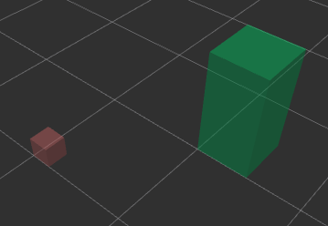
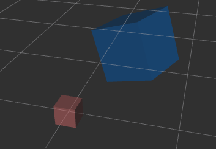
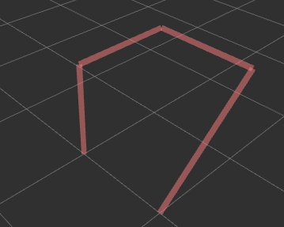

# Overview of the API of RViz Marker Tools

 [](https://www.gnu.org/licenses/gpl-3.0)

## The `Marker` object creation helper functions

The functions are listed in the table below.

| Functions | Descriptions | Remarks |
| ------    | ---------    | ------  |
| create_axisplane_marker | A plane object indicating an axis plane (xy, yz, or xz) given a 2D bounding box | |
| create_cube_marker_from_bbox | A 3D box object given a 3D bounding box | The bbox is aligned with the axes of the reference frame|
| create_cube_marker_from_xyzrpy| A 3D box object given the position, orientation and dimension | The position, orientationm and dimension can all be specified |
| create_arrow_marker | An arrow marker | |
| create_line_marker | A line marker | |
| create_path_marker | A path marker made up of multiple waypoints | |
| create_sphere_marker | A sphere marker | |
| create_cylinder_marker | A cylinder marker | |
| create_text_marker | A text marker | |
| create_mesh_marker | An object marker specified by a mesh file | |

## Common Parameters in the Marker-creation Functions
The following table lists the common parameters to all the marker-creation functions. The parameters name and id form a composite key that must be unique.
| Parameters | Remarks | Examples |
| ---------  | ------  | -------- |\
| name | The namespace of the marker | A string |
| id | The id of the marker | An integer |
| reference_frame | The marker's reference frame | |
| rgbs | The colour of the marker | A list of RGB 3 values or RGBA 4 values (each value is 0 to 1) |
| lifetime | The visible duration in seconds. Only applicable to temporary markers | A number or `rospy.Duration` |

### Axis-plane Markers
Use the function `create_axisplane_marker` to create a plane marker that is aligned with one of the 3 axis plane.

```python
rv = RvizVisualizer()
# add a axis plane marker on xy plane as a persistent marker to the RVizVisualizer
axis_plane_marker_xy = create_axisplane_marker(name='axisplane', id=1, bbox2d=[-1, -1, 1, 1], offset=2, reference_frame='map', axes='xy', rgba=[1, 0, 0])
rv.add_persistent_marker(axis_plane_marker_xy)
# add a axis plane marker on xy plane as a persistent marker to the RVizVisualizer
axis_plane_marker_xz = create_axisplane_marker(name='axisplane', id=2, bbox2d=[-1, -1, 1, 1], offset=2, reference_frame='map', axes='xz', rgba=[0, 1, 0])
rv.add_persistent_marker(axis_plane_marker_xz)
# add a axis plane marker on yz plane as a persistent marker to the RVizVisualizer
axis_plane_marker_xz = create_axisplane_marker(name='axisplane', id=3, bbox2d=[-1, -1, 1, 1], offset=2, reference_frame='map', axes='yz', rgba=[0, 0, 1])
rv.add_persistent_marker(axis_plane_marker_xz)    
```
The axis plane markers are rectangles algined with one of the three axis planes (xy, xz, or yz) in a reference frame. They are useful to indicate planes in movement planning. 

| Parameters | Remarks | Examples |
| ---------  | ------  | -------- |
| bbox2d | A list of 4 numbers defining the bounding box | [xmin, ymin, xmax, ymax] for the xy plane|
| offset | The perpendicular distance to the zero plane | offset of 2 for the xy plane means that the marker is at z = 2 | 
| axes | The axis plane | xy, yz, or xz |

### Cuboid Markers specified in 3D Bounding-box

Use the function `create_cube_marker_from_bbox` to create a cuboid marker defined by a 3D bounding box.

```python
# add a small cube marker
cube_marker_1 = create_cube_marker_from_bbox(name='cube', id=1, bbox3d=[0, 0, 0, 0.2, 0.2, 0.2], reference_frame='map',
                                            rgba=[1.0, 0.5, 0.5, 0.5])
rv.add_persistent_marker(cube_marker_1)
# add a larger cube marker
cube_marker_2 = create_cube_marker_from_bbox(name='cube', id=2, bbox3d=[1, 1, 0, 1.5, 1.5, 1.0], reference_frame='map',
                                            rgba=[0.0, 1.0, 0.5, 0.5])
rv.add_persistent_marker(cube_marker_2)
```


| Parameters | Remarks | Examples |
| ---------  | ------  | -------- |
| bbox3d | A list of 6 numbers defining the bounding box | [xmin, ymin, zmin, xmax, ymax, zmax] for the 3D box|

### Cuboid Markers specified in XYZRPY and Dimensions

Use the function `create_cube_marker_from_bbox` to create a cuboid marker defined by a 3D bounding box.

```python
# add a small cube marker
cuboid_marker_1 = create_cube_marker_from_xyzrpy(name='cube', id=1, xyzrpy=[0, 0, 0, 0, 0, 0], reference_frame='map',
                                            dimensions=0.2, rgba=[1.0, 0.5, 0.5, 0.5])
rv.add_persistent_marker(cuboid_marker_1)
# add a larger cube marker
cuboid_marker_2 = create_cube_marker_from_xyzrpy(name='cube', id=2, xyzrpy=[0.5, 0.5, 0.5, 1.2, 0.0, 1.2], reference_frame='map',
                                            dimensions=0.5, rgba=[0.0, 0.5, 1.0, 0.5])
rv.add_persistent_marker(cuboid_marker_2)
```


| Parameters | Remarks | Examples |
| ---------  | ------  | -------- |
| xyzrpy | A list of 6 numbers defining the pose in xyzrpy format |  |
| dimensions | The size of a cube or the three dimensions of a cuboid | A number or a list of 3 numbers |

### Arrow Markers

Use the function `create_arrow_marker` to create an arrow of a given pose and thickness.

```python
arrow_marker = create_arrow_marker(name='arrow', id=3, xyzrpy=[1, 1, 1, 0, 3.14, 0], reference_frame='map', 
                            dimensions=0.50, rgba=[1.0, 0.5, 0.5, 1.0])
rv.add_persistent_marker(arrow_marker)    
```

| Parameters | Remarks | Examples |
| ---------  | ------  | -------- |
| xyzrpy | A list of 6 numbers defining the pose in xyzrpy format |  |
| dimensions | The thickness of the arrow | A number |

### Line Markers

Use the function `create_line_marker` to create an line defined by the start and the end positions.

```python
line_marker = create_line_marker(name='line', id=i, xyz1=[0.5, 0, 0], xyz2=[0.5, 1, 0], reference_frame='map',
                                                    line_width=0.02, rgba=[1.0, 1.0, 0.0, 1.0])
rv.add_persistent_marker(line_marker)    
```
| Parameters | Remarks | Examples |
| ---------  | ------  | -------- |
| xyz1 | The position of one end of the line | A list of 3 numbers xyz |
| xyz2 | The position of the other end of the line | A list of 3 numbers xyz |
| line_width | The thickness of the line | A number |

### Path Marker

A path is line with zero of more waypoints. Use the function `create_path_marker` to create a path defined by two or more positions in a list.

```python
path_marker = create_path_marker(name='path', id=1, xyzlist=[(0, 0, 0), (0, 0, 1), (0, 1, 1), (1, 1, 1), (1, 0, 0)], reference_frame='map',
                                            line_width=0.05, rgba=[1.0, 0.5, 0.5, 0.5])
rv.add_persistent_marker(path_marker)
```

| Parameters | Remarks | Examples |
| ---------  | ------  | -------- |
| xyzlist | The positions of the start, end and the waypoints in between of a path | A list of xyz positions in a tuple or a list |
| line_width | The thickness of the line | A number |



### Sphere Marker

Use the function `create_sphere_marker` to create a path defined by two or more positions in a list.

```python
sphere_marker = create_sphere_marker(name='sphere', id=1, xyz=[1, 1, 1], reference_frame='map', dimensions=0.20, rgba=[1.0, 0.5, 0.5, 1.0])
rv.add_persistent_marker(sphere_marker) 
```

| Parameters | Remarks | Examples |
| ---------  | ------  | -------- |
| xyz | The centre position of the sphere | A list of three numbers (xyz)|
| dimensions | The size of the sphere | A number |

### Cylinder Marker

Use the function `create_cylinder_marker` to create a cylinder defined by the pose and the dimensions in x, y, and height.

```python
cylinder_marker = create_cylinder_marker(name='path', id=1, xyzrpy=[0, 0.5, 0.5, 0, 0, 0], reference_frame='map',
                                            dimensions=[0.2, 0.2, 0.5], rgba=[1.0, 1.0, 0.5, 0.5])
rv.add_persistent_marker(cylinder_marker)
```

| Parameters | Remarks | Examples |
| ---------  | ------  | -------- |
| xyzrpy | The pose of the cylinder | A list of 6 numbers (xyzrpy)|
| dimensions | The x, y dimension and the height | A list of 3 numbers |

### Mesh Marker

Use the function `create_mesh_marker` to create a marker based on a mesh object, which is defined in a STL or DOE file.

```python
# computing the full path of the stl file
teapot_mesh = 'file://' + os.path.join(os.path.dirname(__file__), '../docs/assets/UtahTeapot.stl')
# teapot_mesh = os.path.join(os.path.dirname(__file__), '../docs/assets/UtahTeapot.stl')
# teapot_mesh = 'package://rviz_marker_tools/docs/assets/UtahTeapot.stl'
# teapot_mesh = 'rviz_marker_tools/docs/assets/UtahTeapot.stl' 
mesh_marker = create_mesh_marker(name='teapot', id=1, file_uri=teapot_mesh, xyzrpy=[-1.0, -1.0, 0.0, 0, 0, 0], 
                            reference_frame='map', dimensions=[0.05, 0.05, 0.05], rgba=[0.5, 1.0, 1.0, 1.0])
rv.add_persistent_marker(mesh_marker) 
```
| Parameters | Remarks | Examples |
| ---------  | ------  | -------- |
| file_uri | The uri of the STL or DOE file containing the mesh object | A string |
| xyzrpy | The pose of the mesh object | A list of 6 numbers (xyzrpy)|
| dimensions | The dimensions of the mesh object | A list of 3 numbers or a single number|

The `file_uri` can be specified in one of the several formats.
- Full path: `/home/qcr/catkin_ws/src/rviz_marker_tools/docs/assets/UTahTeapot.stl`
- Local path under the package: `rviz_marker_tools/docs/assets/UTahTeapot.stl`
- The `file` protocol: `file:///home/qcr/catkin_ws/src/rviz_marker_tools/docs/assets/UTahTeapot.stl`
- The `package` protocol: `package://rviz_marker_tools/docs/assets/UtahTeapot.stl`

Note that the file location must be accessible by RViz if the above formats are specified if RViz is running on another computer. 

### Text Marker

Use the function `create_text_marker` to create a text marker at a pose of a particular size.

```python
text_marker_1 = rv.add_persistent_marker(create_text_marker(name='text', id=1, text='Hello', xyzrpy=[0, 0, 0, 0.2, 0, 0], reference_frame='world', dimensions=0.3))
text_marker_2 = rv.add_persistent_marker(create_text_marker(name='text', id=2, text='World', xyzrpy=[0, 1, 0, 0.2, 0, 0], reference_frame='world', dimensions=0.3))
```
| Parameters | Remarks | Examples |
| ---------  | ------  | -------- |
| text | The text to be displayed | A string |
| xyzrpy | The pose of the text block | A list of 6 numbers (xyzrpy)|
| dimensions | The size of the text block | One number |


### Developer

Dr Andrew Lui, Senior Research Engineer <br />
Robotics and Autonomous Systems, Research Engineering Facility <br />
Research Infrastructure <br />
Queensland University of Technology <br />

Latest update: May 2024
